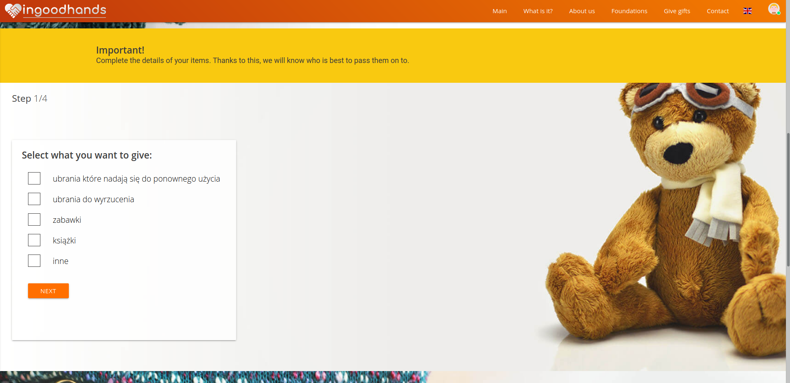
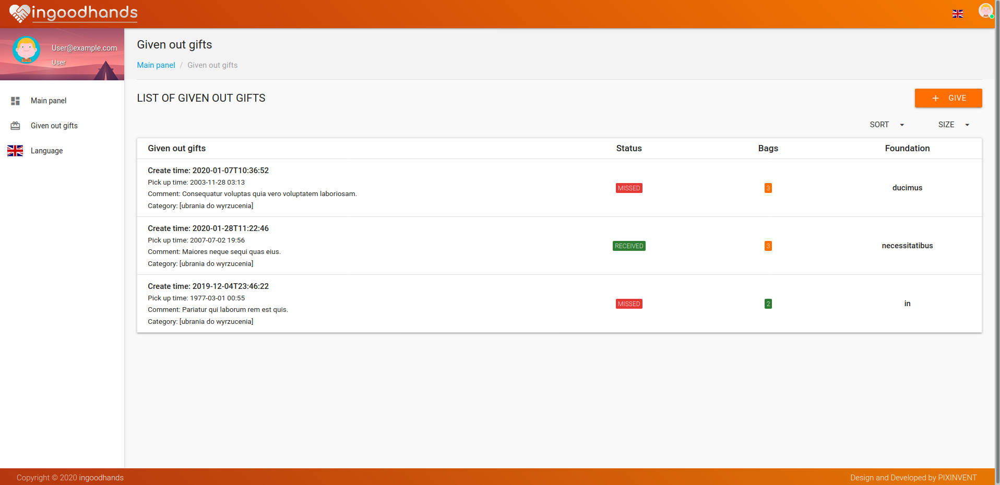

# in good hands

"in good hands" is a project in which everyone will be able to give unnecessary items to trusted institutions.

### Where did the design idea come from?

 * The user has things at home that he does not use, but they are in good condition and wants to give them to people for whom it can be useful - but he does not know how to do it easily.
 
 * There are many available solutions, but many of them require extra effort or do not inspire trust.
   You need to go to verified places, and there is no time or there is no way to go there. However, containers under the house or local collections are unverified and it is not known whether these things will actually go to those in need.

### Run

Application deployed on Heroku by this [link](https://in-good-hands.herokuapp.com)

### Tech

* [Java] - v8
* [Spring Boot] - v2.1.4
* [Spring Data JPA]
* [Spring MVC]
* [Spring Security]
* [Thymeleaf]
* [Lombok]
* [MapStruct] - v 1.3.1, Java annotation processor for the generation of type-safe bean mapping classes
* [Passay] - v1.5.0, password policy enforcement for Java
* [MySQL] - v8.0
* [Maven] -v3.6.3
* [Materialize CSS] - v1.0.0, a modern responsive front-end framework based on Material Design

### Todos

 - Write Tests

   [Java]: <https://www.java.com>
   [Spring Boot]: <https://spring.io/projects/spring-boot>
   [Spring Data JPA]: <https://spring.io/projects/spring-data-jpa>
   [Spring MVC]: <https://docs.spring.io/spring/docs/current/spring-framework-reference/web.html>
   [Spring Security]: <https://spring.io/projects/spring-security>
   [Thymeleaf]: <https://www.thymeleaf.org/>
   [Lombok]: <https://projectlombok.org/>
   [MapStruct]: <https://mapstruct.org/>
   [Passay]: <https://www.passay.org/>
   [MySQL]: <https://www.mysql.com/>
   [Maven]: <https://maven.apache.org/>
   [Materialize CSS]: <https://materializecss.com/>

